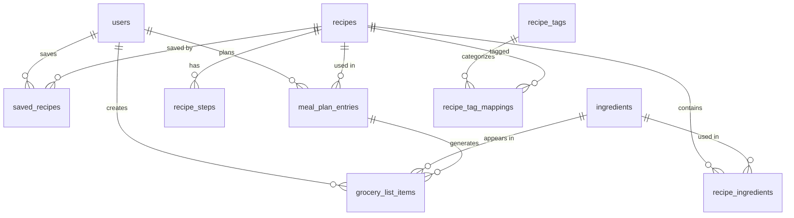

# Phase 1: Data Model & Database Schema

**Feature**: Recipe Planner - Mobile-First Meal Planning & Grocery List App  
**Branch**: `001-recipe-planner-app`  
**Date**: February 11, 2026

## Overview

This document defines the complete database schema for the Recipe Planner application using PostgreSQL via Supabase. The schema supports all functional requirements from [spec.md](./spec.md) with proper normalization, referential integrity, and Row Level Security policies.

## Entity Relationship Diagram



## Core Entities

### 1. Users (Supabase Auth)

**Description**: User accounts managed by Supabase Auth. Extended profile data stored in `user_profiles`.

**Supabase Auth Table**: `auth.users` (managed automatically)
- `id` (UUID, PK)
- `email` (TEXT, UNIQUE)
- `encrypted_password` (TEXT)
- `created_at` (TIMESTAMP)
- `updated_at` (TIMESTAMP)

**Extended Profile Table**: `user_profiles`

```sql
CREATE TABLE user_profiles (
  id UUID PRIMARY KEY REFERENCES auth.users(id) ON DELETE CASCADE,
  display_name TEXT,
  preferred_unit_system TEXT CHECK (preferred_unit_system IN ('metric', 'imperial')) DEFAULT 'metric',
  dietary_preferences JSONB DEFAULT '[]'::jsonb, -- e.g., ["vegetarian", "gluten-free"]
  created_at TIMESTAMP WITH TIME ZONE DEFAULT NOW(),
  updated_at TIMESTAMP WITH TIME ZONE DEFAULT NOW()
);

-- RLS Policies
ALTER TABLE user_profiles ENABLE ROW LEVEL SECURITY;

CREATE POLICY "Users can view own profile"
  ON user_profiles FOR SELECT
  USING (auth.uid() = id);

CREATE POLICY "Users can update own profile"
  ON user_profiles FOR UPDATE
  USING (auth.uid() = id);
```

**Attributes**:
- `id`: UUID (matches Supabase auth.users.id)
- `display_name`: Optional display name
- `preferred_unit_system`: 'metric' or 'imperial' for ingredient display
- `dietary_preferences`: JSON array of dietary tags
- `created_at`, `updated_at`: Timestamps

**Relationships**:
- One-to-many with `saved_recipes`
- One-to-many with `meal_plan_entries`
- One-to-many with `grocery_list_items`

---

### 2. Recipes

**Description**: Core recipe entity containing metadata, images, and nutritional information.

```sql
CREATE TABLE recipes (
  id UUID PRIMARY KEY DEFAULT gen_random_uuid(),
  name TEXT NOT NULL,
  description TEXT,
  cover_image_url TEXT NOT NULL,
  cooking_time_minutes INTEGER NOT NULL CHECK (cooking_time_minutes > 0),
  prep_time_minutes INTEGER DEFAULT 0,
  servings INTEGER NOT NULL DEFAULT 1 CHECK (servings > 0),
  calories_per_serving INTEGER,
  protein_grams DECIMAL(6,2),
  carbs_grams DECIMAL(6,2),
  fat_grams DECIMAL(6,2),
  difficulty_level TEXT CHECK (difficulty_level IN ('easy', 'medium', 'hard')),
  rating DECIMAL(3,2) CHECK (rating >= 0 AND rating <= 5),
  rating_count INTEGER DEFAULT 0,
  is_public BOOLEAN DEFAULT true,
  created_by UUID REFERENCES auth.users(id) ON DELETE SET NULL,
  created_at TIMESTAMP WITH TIME ZONE DEFAULT NOW(),
  updated_at TIMESTAMP WITH TIME ZONE DEFAULT NOW()
);

-- Indexes
CREATE INDEX idx_recipes_rating ON recipes(rating DESC);
CREATE INDEX idx_recipes_cooking_time ON recipes(cooking_time_minutes);
CREATE INDEX idx_recipes_calories ON recipes(calories_per_serving);
CREATE INDEX idx_recipes_created_by ON recipes(created_by);

-- Full-text search index
CREATE INDEX idx_recipes_name_search ON recipes USING GIN (to_tsvector('english', name || ' ' || COALESCE(description, '')));

-- RLS Policies
ALTER TABLE recipes ENABLE ROW LEVEL SECURITY;

CREATE POLICY "Public recipes are viewable by everyone"
  ON recipes FOR SELECT
  USING (is_public = true OR created_by = auth.uid());
```

**Attributes**:
- `id`: UUID primary key
- `name`: Recipe name (e.g., "Pan-Seared Salmon")
- `description`: Short description or tagline
- `cover_image_url`: URL to cover image in Supabase Storage
- `cooking_time_minutes`: Active cooking time
- `prep_time_minutes`: Preparation time
- `servings`: Default number of servings
- `calories_per_serving`: Nutritional information
- `protein_grams`, `carbs_grams`, `fat_grams`: Macros
- `difficulty_level`: easy/medium/hard
- `rating`: Average user rating (0-5)
- `rating_count`: Number of ratings
- `is_public`: Whether recipe is public or private
- `created_by`: User who created recipe (nullable for system recipes)

**Relationships**:
- One-to-many with `recipe_ingredients`
- One-to-many with `recipe_steps`
- One-to-many with `saved_recipes`
- One-to-many with `meal_plan_entries`
- Many-to-many with `recipe_tags` (via `recipe_tag_mappings`)

**Validation Rules**:
- `cooking_time_minutes` must be > 0
- `servings` must be > 0
- `rating` must be between 0 and 5
- `difficulty_level` must be one of: easy, medium, hard

---

### 3. Ingredients

**Description**: Master list of ingredients with category and nutritional metadata.

```sql
CREATE TABLE ingredients (
  id UUID PRIMARY KEY DEFAULT gen_random_uuid(),
  name TEXT NOT NULL UNIQUE,
  category TEXT NOT NULL CHECK (category IN (
    'vegetables', 'fruits', 'meat', 'seafood', 'dairy', 
    'grains', 'seasonings', 'condiments', 'baking', 'other'
  )),
  default_unit TEXT NOT NULL, -- 'grams', 'ml', 'pieces', 'cups', etc.
  icon_emoji TEXT, -- e.g., '🥦', '🥩', '🥫'
  created_at TIMESTAMP WITH TIME ZONE DEFAULT NOW()
);

-- Indexes
CREATE INDEX idx_ingredients_category ON ingredients(category);
CREATE INDEX idx_ingredients_name_search ON ingredients USING GIN (to_tsvector('english', name));

-- RLS Policy (read-only for all users)
ALTER TABLE ingredients ENABLE ROW LEVEL SECURITY;

CREATE POLICY "Ingredients are viewable by everyone"
  ON ingredients FOR SELECT
  USING (true);
```

**Attributes**:
- `id`: UUID primary key
- `name`: Ingredient name (e.g., "Garlic", "Chicken Breast")
- `category`: vegetables, fruits, meat, seafood, dairy, grains, seasonings, condiments, baking, other
- `default_unit`: Default measurement unit
- `icon_emoji`: Optional emoji for visual display
- `created_at`: Timestamp

**Relationships**:
- One-to-many with `recipe_ingredients`
- One-to-many with `grocery_list_items`

---

### 4. Recipe Ingredients (Junction Table)

**Description**: Links recipes to ingredients with quantities and preparation notes.

```sql
CREATE TABLE recipe_ingredients (
  id UUID PRIMARY KEY DEFAULT gen_random_uuid(),
  recipe_id UUID NOT NULL REFERENCES recipes(id) ON DELETE CASCADE,
  ingredient_id UUID NOT NULL REFERENCES ingredients(id) ON DELETE CASCADE,
  quantity DECIMAL(10,3) NOT NULL CHECK (quantity > 0),
  unit TEXT NOT NULL, -- 'grams', 'cups', 'tablespoons', 'pieces', etc.
  preparation_note TEXT, -- e.g., "finely chopped", "to taste"
  is_optional BOOLEAN DEFAULT false,
  display_order INTEGER NOT NULL,
  UNIQUE(recipe_id, ingredient_id)
);

-- Indexes
CREATE INDEX idx_recipe_ingredients_recipe ON recipe_ingredients(recipe_id);
CREATE INDEX idx_recipe_ingredients_ingredient ON recipe_ingredients(ingredient_id);

-- RLS Policies
ALTER TABLE recipe_ingredients ENABLE ROW LEVEL SECURITY;

CREATE POLICY "Recipe ingredients are viewable with recipe"
  ON recipe_ingredients FOR SELECT
  USING (
    EXISTS (
      SELECT 1 FROM recipes 
      WHERE recipes.id = recipe_ingredients.recipe_id 
        AND (recipes.is_public = true OR recipes.created_by = auth.uid())
    )
  );
```

**Attributes**:
- `id`: UUID primary key
- `recipe_id`: Foreign key to recipes
- `ingredient_id`: Foreign key to ingredients
- `quantity`: Numeric quantity (e.g., 2.5)
- `unit`: Measurement unit (grams, cups, tablespoons, pieces, etc.)
- `preparation_note`: Instructions for ingredient prep
- `is_optional`: Whether ingredient is optional
- `display_order`: Order to display in ingredients list

**Relationships**:
- Many-to-one with `recipes`
- Many-to-one with `ingredients`

**Validation Rules**:
- `quantity` must be > 0
- Unique constraint on (recipe_id, ingredient_id) prevents duplicates

---

### 5. Recipe Steps

**Description**: Step-by-step cooking instructions for recipes.

```sql
CREATE TABLE recipe_steps (
  id UUID PRIMARY KEY DEFAULT gen_random_uuid(),
  recipe_id UUID NOT NULL REFERENCES recipes(id) ON DELETE CASCADE,
  step_number INTEGER NOT NULL CHECK (step_number > 0),
  instruction TEXT NOT NULL,
  image_url TEXT,
  video_url TEXT,
  duration_minutes INTEGER, -- Optional time estimate for this step
  created_at TIMESTAMP WITH TIME ZONE DEFAULT NOW(),
  UNIQUE(recipe_id, step_number)
);

-- Indexes
CREATE INDEX idx_recipe_steps_recipe ON recipe_steps(recipe_id, step_number);

-- RLS Policies
ALTER TABLE recipe_steps ENABLE ROW LEVEL SECURITY;

CREATE POLICY "Recipe steps are viewable with recipe"
  ON recipe_steps FOR SELECT
  USING (
    EXISTS (
      SELECT 1 FROM recipes 
      WHERE recipes.id = recipe_steps.recipe_id 
        AND (recipes.is_public = true OR recipes.created_by = auth.uid())
    )
  );
```

**Attributes**:
- `id`: UUID primary key
- `recipe_id`: Foreign key to recipes
- `step_number`: Sequential step number (1, 2, 3, ...)
- `instruction`: Text instruction for this step
- `image_url`: Optional step illustration image
- `video_url`: Optional step video
- `duration_minutes`: Optional time estimate
- `created_at`: Timestamp

**Relationships**:
- Many-to-one with `recipes`

**Validation Rules**:
- `step_number` must be > 0
- Unique constraint on (recipe_id, step_number)

---

### 6. Recipe Tags

**Description**: Category tags for filtering and discovery (e.g., #QuickLunch, #Healthy).

```sql
CREATE TABLE recipe_tags (
  id UUID PRIMARY KEY DEFAULT gen_random_uuid(),
  name TEXT NOT NULL UNIQUE,
  slug TEXT NOT NULL UNIQUE, -- URL-friendly version (e.g., "quick-lunch")
  icon_emoji TEXT,
  display_order INTEGER DEFAULT 0,
  created_at TIMESTAMP WITH TIME ZONE DEFAULT NOW()
);

-- Index
CREATE INDEX idx_recipe_tags_slug ON recipe_tags(slug);

-- RLS Policy
ALTER TABLE recipe_tags ENABLE ROW LEVEL SECURITY;

CREATE POLICY "Recipe tags are viewable by everyone"
  ON recipe_tags FOR SELECT
  USING (true);
```

**Attributes**:
- `id`: UUID primary key
- `name`: Tag display name (e.g., "Quick Lunch")
- `slug`: URL-friendly slug (e.g., "quick-lunch")
- `icon_emoji`: Optional emoji for visual display
- `display_order`: Sort order for tag display
- `created_at`: Timestamp

**Relationships**:
- Many-to-many with `recipes` (via `recipe_tag_mappings`)

---

### 7. Recipe Tag Mappings (Junction Table)

**Description**: Associates recipes with tags.

```sql
CREATE TABLE recipe_tag_mappings (
  recipe_id UUID NOT NULL REFERENCES recipes(id) ON DELETE CASCADE,
  tag_id UUID NOT NULL REFERENCES recipe_tags(id) ON DELETE CASCADE,
  created_at TIMESTAMP WITH TIME ZONE DEFAULT NOW(),
  PRIMARY KEY (recipe_id, tag_id)
);

-- Indexes
CREATE INDEX idx_recipe_tag_mappings_recipe ON recipe_tag_mappings(recipe_id);
CREATE INDEX idx_recipe_tag_mappings_tag ON recipe_tag_mappings(tag_id);

-- RLS Policy
ALTER TABLE recipe_tag_mappings ENABLE ROW LEVEL SECURITY;

CREATE POLICY "Recipe tag mappings are viewable by everyone"
  ON recipe_tag_mappings FOR SELECT
  USING (true);
```

**Attributes**:
- `recipe_id`: Foreign key to recipes
- `tag_id`: Foreign key to recipe_tags
- `created_at`: Timestamp
- **Composite Primary Key**: (recipe_id, tag_id)

**Relationships**:
- Many-to-one with `recipes`
- Many-to-one with `recipe_tags`

---

### 8. Saved Recipes (User's Cookbook)

**Description**: User's personal collection of saved recipes.

```sql
CREATE TABLE saved_recipes (
  user_id UUID NOT NULL REFERENCES auth.users(id) ON DELETE CASCADE,
  recipe_id UUID NOT NULL REFERENCES recipes(id) ON DELETE CASCADE,
  notes TEXT, -- Personal notes about the recipe
  saved_at TIMESTAMP WITH TIME ZONE DEFAULT NOW(),
  PRIMARY KEY (user_id, recipe_id)
);

-- Indexes
CREATE INDEX idx_saved_recipes_user ON saved_recipes(user_id, saved_at DESC);
CREATE INDEX idx_saved_recipes_recipe ON saved_recipes(recipe_id);

-- RLS Policies
ALTER TABLE saved_recipes ENABLE ROW LEVEL SECURITY;

CREATE POLICY "Users can view own saved recipes"
  ON saved_recipes FOR SELECT
  USING (auth.uid() = user_id);

CREATE POLICY "Users can insert own saved recipes"
  ON saved_recipes FOR INSERT
  WITH CHECK (auth.uid() = user_id);

CREATE POLICY "Users can delete own saved recipes"
  ON saved_recipes FOR DELETE
  USING (auth.uid() = user_id);

CREATE POLICY "Users can update own saved recipes"
  ON saved_recipes FOR UPDATE
  USING (auth.uid() = user_id);
```

**Attributes**:
- `user_id`: Foreign key to users
- `recipe_id`: Foreign key to recipes
- `notes`: Optional personal notes
- `saved_at`: Timestamp when saved
- **Composite Primary Key**: (user_id, recipe_id)

**Relationships**:
- Many-to-one with `auth.users`
- Many-to-one with `recipes`

---

### 9. Meal Plan Entries

**Description**: User's planned meals organized by date and meal type.

```sql
CREATE TYPE meal_type AS ENUM ('breakfast', 'lunch', 'dinner', 'snack');

CREATE TABLE meal_plan_entries (
  id UUID PRIMARY KEY DEFAULT gen_random_uuid(),
  user_id UUID NOT NULL REFERENCES auth.users(id) ON DELETE CASCADE,
  recipe_id UUID REFERENCES recipes(id) ON DELETE CASCADE,
  quick_note TEXT, -- For meals without recipe (e.g., "eating out")
  meal_date DATE NOT NULL,
  meal_type meal_type NOT NULL,
  servings INTEGER DEFAULT 1 CHECK (servings > 0),
  is_completed BOOLEAN DEFAULT false,
  created_at TIMESTAMP WITH TIME ZONE DEFAULT NOW(),
  updated_at TIMESTAMP WITH TIME ZONE DEFAULT NOW(),
  CONSTRAINT recipe_or_note_required CHECK (
    (recipe_id IS NOT NULL) OR (quick_note IS NOT NULL)
  )
);

-- Indexes
CREATE INDEX idx_meal_plan_user_date ON meal_plan_entries(user_id, meal_date);
CREATE INDEX idx_meal_plan_recipe ON meal_plan_entries(recipe_id);
CREATE INDEX idx_meal_plan_user_type ON meal_plan_entries(user_id, meal_type);

-- RLS Policies
ALTER TABLE meal_plan_entries ENABLE ROW LEVEL SECURITY;

CREATE POLICY "Users can manage own meal plans"
  ON meal_plan_entries
  USING (auth.uid() = user_id)
  WITH CHECK (auth.uid() = user_id);
```

**Attributes**:
- `id`: UUID primary key
- `user_id`: Foreign key to users
- `recipe_id`: Foreign key to recipes (nullable for quick notes)
- `quick_note`: Free-form text for meals without recipe
- `meal_date`: Date of the meal
- `meal_type`: breakfast, lunch, dinner, or snack
- `servings`: Number of servings to prepare
- `is_completed`: Whether meal has been cooked/consumed
- `created_at`, `updated_at`: Timestamps

**Relationships**:
- Many-to-one with `auth.users`
- Many-to-one with `recipes` (optional)
- One-to-many with `grocery_list_items`

**Validation Rules**:
- Either `recipe_id` OR `quick_note` must be present (not both null)
- `servings` must be > 0

**State Transitions**:
- Created → is_completed = false
- User marks as cooked → is_completed = true

---

### 10. Grocery List Items

**Description**: Shopping list items generated from meal plans and user-added items.

```sql
CREATE TABLE grocery_list_items (
  id UUID PRIMARY KEY DEFAULT gen_random_uuid(),
  user_id UUID NOT NULL REFERENCES auth.users(id) ON DELETE CASCADE,
  ingredient_id UUID REFERENCES ingredients(id) ON DELETE CASCADE,
  custom_name TEXT, -- For custom items not in ingredients table
  quantity DECIMAL(10,3) NOT NULL CHECK (quantity > 0),
  unit TEXT NOT NULL,
  category TEXT,
  is_checked BOOLEAN DEFAULT false,
  source_meal_plan_ids UUID[] DEFAULT ARRAY[]::UUID[], -- Array of meal plan entry IDs
  notes TEXT,
  created_at TIMESTAMP WITH TIME ZONE DEFAULT NOW(),
  updated_at TIMESTAMP WITH TIME ZONE DEFAULT NOW(),
  CONSTRAINT ingredient_or_custom_required CHECK (
    (ingredient_id IS NOT NULL) OR (custom_name IS NOT NULL)
  )
);

-- Indexes
CREATE INDEX idx_grocery_list_user ON grocery_list_items(user_id);
CREATE INDEX idx_grocery_list_ingredient ON grocery_list_items(ingredient_id);
CREATE INDEX idx_grocery_list_checked ON grocery_list_items(user_id, is_checked);

-- RLS Policies
ALTER TABLE grocery_list_items ENABLE ROW LEVEL SECURITY;

CREATE POLICY "Users can manage own grocery list"
  ON grocery_list_items
  USING (auth.uid() = user_id)
  WITH CHECK (auth.uid() = user_id);
```

**Attributes**:
- `id`: UUID primary key
- `user_id`: Foreign key to users
- `ingredient_id`: Foreign key to ingredients (nullable for custom items)
- `custom_name`: Name for user-added items not in ingredient database
- `quantity`: Total quantity needed
- `unit`: Measurement unit
- `category`: Category for grouping (inherited from ingredient or user-specified)
- `is_checked`: Whether item has been purchased
- `source_meal_plan_ids`: Array of meal plan entry IDs that generated this item
- `notes`: Combined notes showing which recipes use this ingredient
- `created_at`, `updated_at`: Timestamps

**Relationships**:
- Many-to-one with `auth.users`
- Many-to-one with `ingredients` (optional)
- Referenced by `meal_plan_entries` (via source_meal_plan_ids array)

**Validation Rules**:
- Either `ingredient_id` OR `custom_name` must be present
- `quantity` must be > 0

---

## Database Functions & Triggers

### Auto-Update Timestamps

```sql
CREATE OR REPLACE FUNCTION update_updated_at_column()
RETURNS TRIGGER AS $$
BEGIN
    NEW.updated_at = NOW();
    RETURN NEW;
END;
$$ LANGUAGE plpgsql;

-- Apply to relevant tables
CREATE TRIGGER update_user_profiles_updated_at
    BEFORE UPDATE ON user_profiles
    FOR EACH ROW
    EXECUTE FUNCTION update_updated_at_column();

CREATE TRIGGER update_recipes_updated_at
    BEFORE UPDATE ON recipes
    FOR EACH ROW
    EXECUTE FUNCTION update_updated_at_column();

CREATE TRIGGER update_meal_plan_entries_updated_at
    BEFORE UPDATE ON meal_plan_entries
    FOR EACH ROW
    EXECUTE FUNCTION update_updated_at_column();

CREATE TRIGGER update_grocery_list_items_updated_at
    BEFORE UPDATE ON grocery_list_items
    FOR EACH ROW
    EXECUTE FUNCTION update_updated_at_column();
```

### Generate Grocery List from Meal Plan

```sql
-- Function to regenerate grocery list from meal plan
CREATE OR REPLACE FUNCTION regenerate_grocery_list(p_user_id UUID, p_start_date DATE, p_end_date DATE)
RETURNS void AS $$
BEGIN
  -- Delete existing grocery list items for this date range
  DELETE FROM grocery_list_items
  WHERE user_id = p_user_id
    AND id IN (
      SELECT UNNEST(source_meal_plan_ids)
      FROM meal_plan_entries
      WHERE user_id = p_user_id
        AND meal_date BETWEEN p_start_date AND p_end_date
    );
  
  -- Insert aggregated ingredients from meal plan
  INSERT INTO grocery_list_items (
    user_id, ingredient_id, custom_name, quantity, unit, category, source_meal_plan_ids, notes
  )
  SELECT
    p_user_id,
    ri.ingredient_id,
    NULL, -- custom_name
    SUM(ri.quantity * mpe.servings / r.servings), -- Scale quantity by servings
    ri.unit,
    i.category,
    ARRAY_AGG(DISTINCT mpe.id), -- Source meal plan IDs
    STRING_AGG(DISTINCT r.name, ', ') -- Recipe names
  FROM meal_plan_entries mpe
  JOIN recipes r ON mpe.recipe_id = r.id
  JOIN recipe_ingredients ri ON r.id = ri.recipe_id
  JOIN ingredients i ON ri.ingredient_id = i.id
  WHERE mpe.user_id = p_user_id
    AND mpe.meal_date BETWEEN p_start_date AND p_end_date
    AND mpe.recipe_id IS NOT NULL
  GROUP BY ri.ingredient_id, ri.unit, i.category;
END;
$$ LANGUAGE plpgsql;
```

## Data Access Patterns

### Common Queries

**1. Get Trending Recipes (Home Page)**
```sql
SELECT id, name, cover_image_url, cooking_time_minutes, calories_per_serving, rating
FROM recipes
WHERE is_public = true
ORDER BY rating DESC, rating_count DESC
LIMIT 20;
```

**2. Search Recipes with Filters**
```sql
SELECT r.id, r.name, r.cover_image_url, r.cooking_time_minutes, r.calories_per_serving, r.rating
FROM recipes r
WHERE r.is_public = true
  AND r.cooking_time_minutes <= :max_time
  AND r.calories_per_serving <= :max_calories
  AND to_tsvector('english', r.name || ' ' || COALESCE(r.description, '')) @@ plainto_tsquery(:search_query)
ORDER BY r.rating DESC
LIMIT 50;
```

**3. Get Recipe Detail with Ingredients and Steps**
```sql
-- Recipe metadata
SELECT * FROM recipes WHERE id = :recipe_id;

-- Ingredients (ordered)
SELECT i.name, ri.quantity, ri.unit, ri.preparation_note, ri.is_optional
FROM recipe_ingredients ri
JOIN ingredients i ON ri.ingredient_id = i.id
WHERE ri.recipe_id = :recipe_id
ORDER BY ri.display_order;

-- Steps (ordered)
SELECT step_number, instruction, image_url, video_url, duration_minutes
FROM recipe_steps
WHERE recipe_id = :recipe_id
ORDER BY step_number;
```

**4. Get User's Meal Plan for Week**
```sql
SELECT mpe.id, mpe.meal_date, mpe.meal_type, mpe.servings, mpe.quick_note,
       r.id as recipe_id, r.name as recipe_name, r.cover_image_url,
       r.cooking_time_minutes, r.calories_per_serving
FROM meal_plan_entries mpe
LEFT JOIN recipes r ON mpe.recipe_id = r.id
WHERE mpe.user_id = :user_id
  AND mpe.meal_date BETWEEN :start_date AND :end_date
ORDER BY mpe.meal_date, mpe.meal_type;
```

**5. Get User's Grocery List (Grouped by Category)**
```sql
SELECT 
  gli.id,
  COALESCE(i.name, gli.custom_name) as item_name,
  gli.quantity,
  gli.unit,
  COALESCE(gli.category, i.category) as category,
  gli.is_checked,
  gli.notes,
  i.icon_emoji
FROM grocery_list_items gli
LEFT JOIN ingredients i ON gli.ingredient_id = i.id
WHERE gli.user_id = :user_id
ORDER BY 
  CASE COALESCE(gli.category, i.category)
    WHEN 'vegetables' THEN 1
    WHEN 'fruits' THEN 2
    WHEN 'meat' THEN 3
    WHEN 'seafood' THEN 4
    WHEN 'dairy' THEN 5
    WHEN 'grains' THEN 6
    WHEN 'seasonings' THEN 7
    ELSE 8
  END,
  item_name;
```

## Migration Strategy

### Initial Schema Setup

1. **Supabase CLI Setup**: Install Supabase CLI and initialize project
2. **Create Migration File**: `supabase migration new initial_schema`
3. **Execute Migration**: Run SQL schema creation statements
4. **Enable RLS**: Ensure Row Level Security is enabled on all user-facing tables
5. **Seed Data**: Create initial recipes, ingredients, and tags for testing

### Migration Files Location

```
supabase/
├── migrations/
│   ├── 20260211000001_initial_schema.sql
│   ├── 20260211000002_add_rls_policies.sql
│   └── 20260211000003_seed_data.sql
├── seed.sql
└── config.toml
```

## Data Integrity Enforcement

### Referential Integrity
- All foreign keys use `REFERENCES` with `ON DELETE CASCADE` or `ON DELETE SET NULL` as appropriate
- Junction tables use composite primary keys to prevent duplicates
- Check constraints enforce valid enum values and numeric ranges

### Row Level Security (RLS)
- All user-facing tables have RLS enabled
- Policies ensure users can only access their own data (meal plans, grocery lists, saved recipes)
- Public recipes are readable by all authenticated users
- Ingredients and tags are read-only for all users

### Data Validation
- Check constraints for positive quantities and valid enums
- Unique constraints on natural keys (ingredient names, tag slugs)
- NOT NULL constraints on required fields
- Trigger functions for automatic timestamp updates

## Performance Optimizations

### Indexes
- B-tree indexes on foreign keys for JOIN performance
- GIN indexes for full-text search on recipe names/descriptions
- Composite indexes for common query patterns (user_id + date, recipe_id + step_number)
- Partial indexes on filtered columns (is_public = true)

### Query Optimization
- Use materialized views for complex aggregations if needed
- Implement cursor-based pagination for infinite scroll (trending recipes)
- Cache frequently accessed data (popular recipes, tags) in Redis (future enhancement)
- Use `EXPLAIN ANALYZE` to optimize slow queries

## Next Steps

With the data model complete, proceed to:
1. Generate API contracts for Server Actions and Route Handlers
2. Create migration files in Supabase project
3. Develop TypeScript types from database schema using Supabase CLI
4. Implement Zod validation schemas matching database constraints
